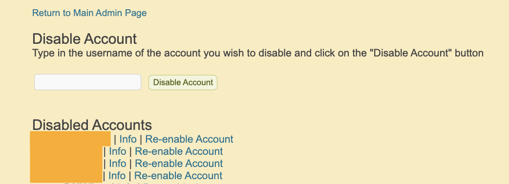

# Introduction

This page allows administrators to disable users who have not acted according to WISE's privacy policy. An example would be a spammer who creates many accounts or creates units with content that is inappropriate for our users.

_Figure: WISE admin can disable and re-enable users_

# Disabling a User

From the Admin homepage, click on the "Enable/Disable User" link. You will see a text input to enter the username of the user that you want to disable.

A disabled user will no longer be able to sign in to WISE.

# Re-enabling a User

This page also lists all of the usernames that have been previously disabled. To re-enable the user account, click on the "Re-enable account" link next to the username.
