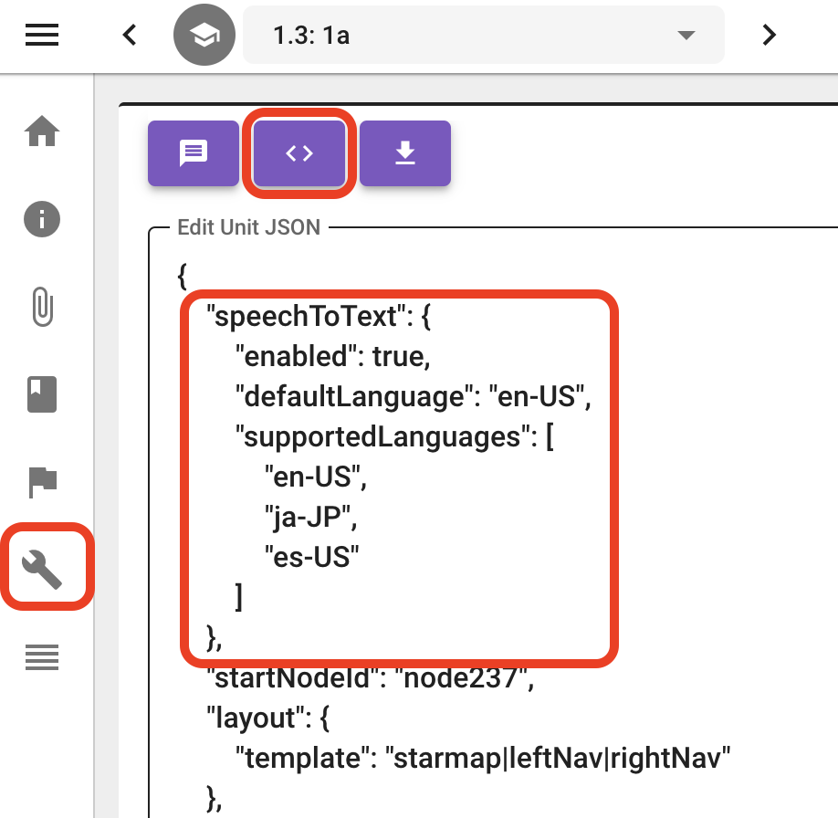

## Introduction

WISE can be configured to use the AWS transcribe service to perform speech-to-text transcription. This can be used to allow students to speak their response to Open Response activities.

Note: WISE needs to be served over HTTPS for STT to function.

## WISE setup instructions

1. You'll need to [sign up for AWS and set up the transcribe service on AWS](https://docs.aws.amazon.com/transcribe/latest/dg/streaming-setting-up.html), update the properties settings, and restart WISE. We wrote about which properties to update [here](https://github.com/WISE-Community/WISE-Docker-Server?tab=readme-ov-file#properties-configuration) - search for "speech-to-text"
2. Once you restart WISE, open up a unit in the Authoring Tool, and open the "Advanced Settings" view. Click on the "Show JSON" button to view the unit's JSON. At the top-level of the JSON, type in this "speechToText" block:

```
"speechToText": {
    "enabled": true,
    "defaultLanguage": "en-US",
    "supportedLanguages": [
        "en-US",
        "ja-JP",
        "es-US"
    ]
},
```



Change the "defaultLanguage" and "supportedLanguages" values as you see fit. In this screenshot, English (US) is the default language, and the transcription will support languages spoken in English, Japanese, and Spanish.

(Note: we will make editing this setting easier in the future!)
