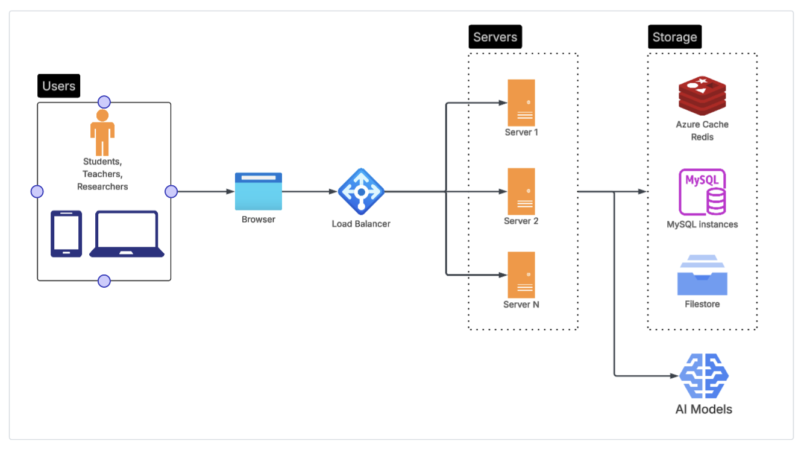

# Sample load-balanced server architecture

_This is a sample WISE server architecture. Your actual server architecture may differ._

# Scalable server and storage

To run WISE, you need to set up a WISE server. As your userbase grows, you may need to scale your WISE server. In the sample above, use use a load balancer in front of multiple WISE servers. Each server can be scaled vertically or horizontally, as needed. The storage layer is also scalable. If you're using AWS, you can use S3 and EFS for filestore, RDS for MySQL, and ElastiCache for Redis.

# AI Models

AI Models are accessed via API calls. The server stores the API keys and model endpoints, and the client sends requests to the server, which then forwards them to the AI models.
