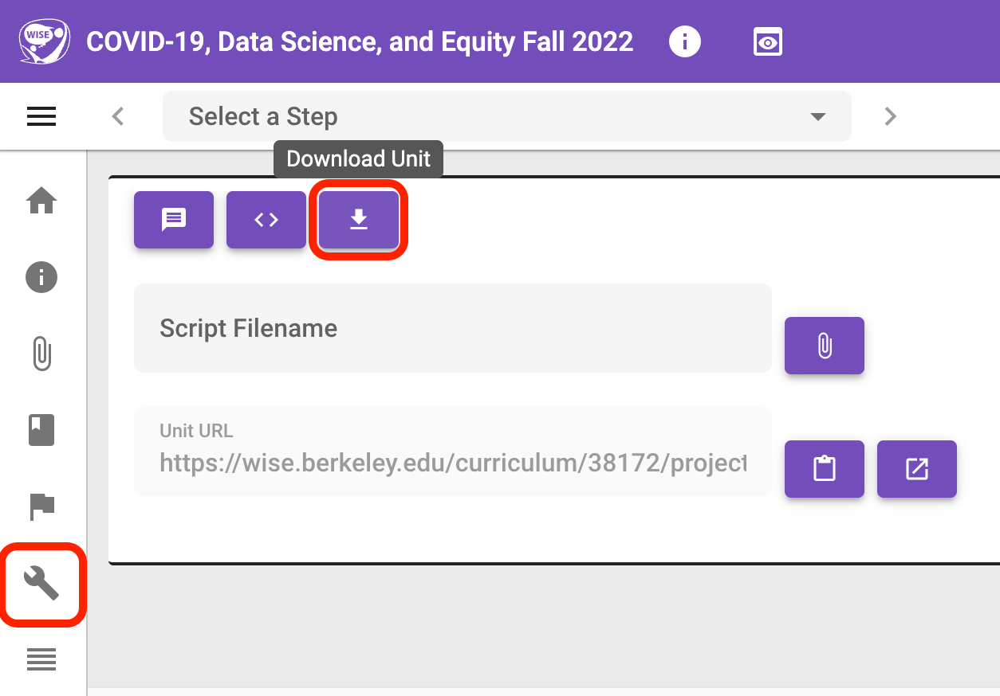
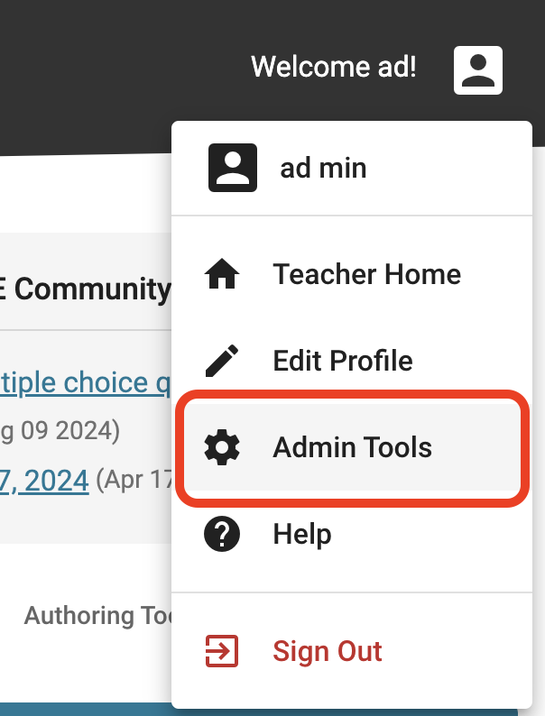
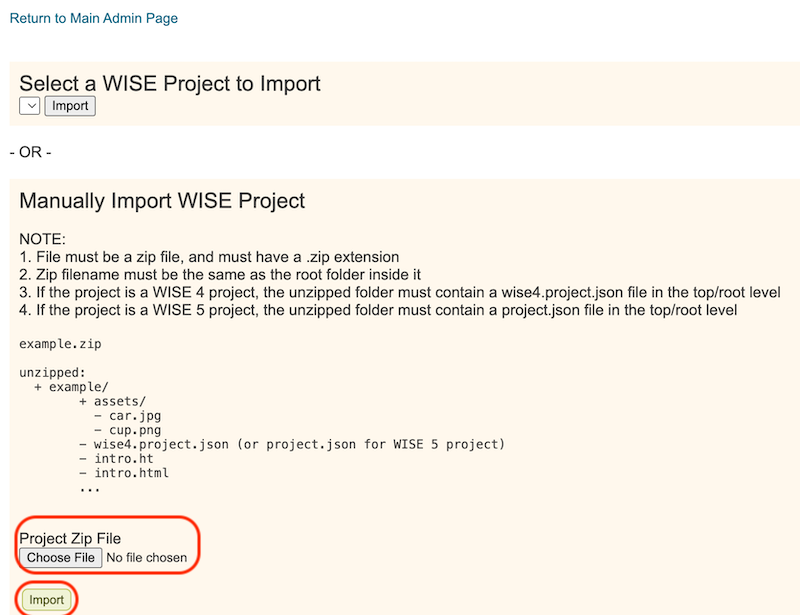

# Introduction

This page describes how you to export a unit from one WISE instance and import it into another. These steps allow you to transfer units between WISE instances.

# Exporting a unit from WISE

1. Launch the unit in the Authoring Tool.
2. Go to the "Advanced Settings" view using the side-navigation.
3. Click on the "Download Unit" button. This will download the unit as a zip file to your own computer.

# Importing a unit into WISE

1. Login to WISE as admin user, or a user with admin privileges.
2. Click on the profile button at the top-right (or top-left if you are using RTL language) and select "Admin Tools" in the drop-down menu.
    
3. Click on the "Import a Project" link under the "Project Management" section.
4. Click on the "Choose File" button in the "Manually Import WISE Project" section.
5. Select the zip file that you downloaded in the section above, and click on the "Import" button. This will import the unit into WISE. Once the import is completed, you should see a confirmation page with the new unit's information. You can now find this unit in your Unit Library.

