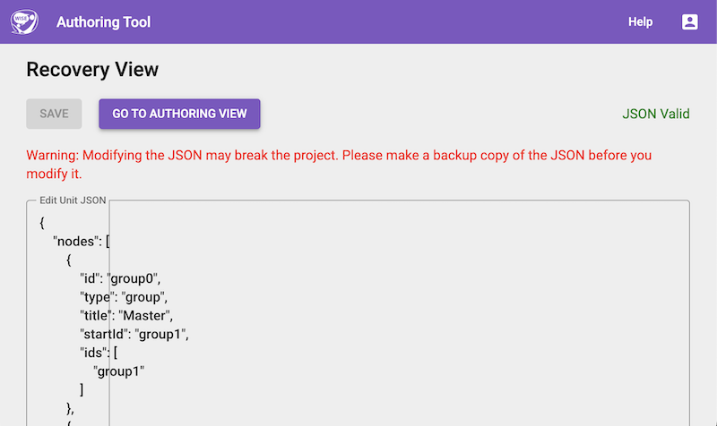

# Introduction

When a unit becomes broken and can no longer be loaded in the Authoring Tool, administrators can use the unit recovery mode to manually edit the unit's JSON structure.

_Figure: Unit Recovery Mode_

# Accessing Unit Recovery Mode

The recovery page can be accessed by navigating to the following URL in your browser:

`[PATH_TO_WISE]/teacher/edit/recovery/[UNIT_ID]`

Replace `[PATH_TO_WISE]` with your WISE instance's base URL and `[UNIT_ID]` with the ID of the broken unit.

# Using the Recovery Page

When you access the recovery page, it will open the raw JSON for the broken unit in a textarea.

As an administrator, you can directly edit this JSON here to fix any structural issues or remove problematic components that are preventing the unit from loading properly. Once your edits are complete, save the changes to restore the unit's functionality.
