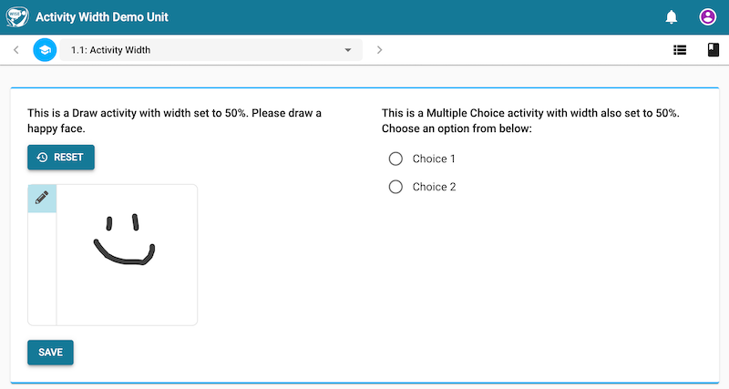
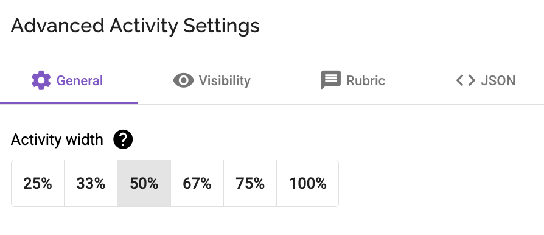

# Introduction

The activity's width determines how it appears on the screen in the student view.

By default, the activity width is set to **100%**, meaning it will span the entire width of the available space. However, you can change this setting to create different layouts.

### Student View

_The activity widths of two activities are set to 50% in this example, and they appear side-by-side._

### Authoring Tool View

_You can change the activity width in the authoring tool_

## Available Width Settings

You can set the activity width to one of the following percentages:

- 25%
- 33%
- 50%
- 67%
- 75%
- 100%

## Creating Side-by-Side Layouts

If you want activities to appear next to each other, you can adjust their widths so they fit together on the same line. For example:

- If two adjacent activities are set to **50% each**, they will appear side-by-side.
- You can also mix widths, such as setting one activity to **67%** and the adjacent one to **33%**, and they will also appear side-by-side.
