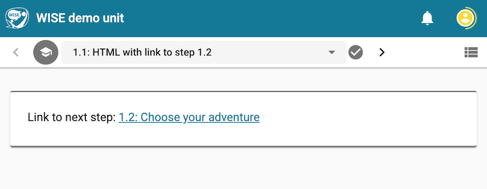
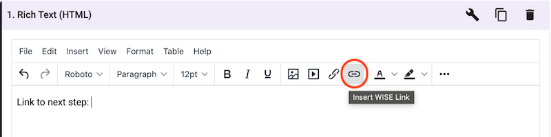
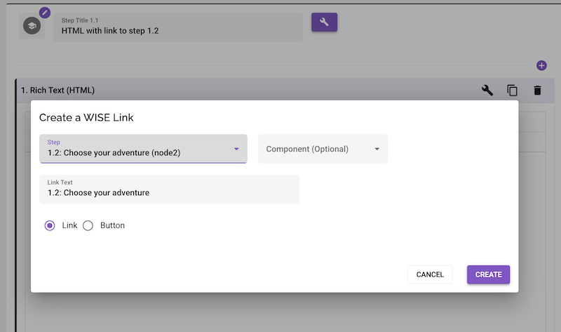

## Introduction

You can create a link from an HTML component to another step or a component in the same unit. This can be useful to move students to review previous page(s) of the unit, or let them choose to jump them forward in the unit.

_Link from step 1.1 to step 1.2_

## Authoring

1. Open the HTML component authoring view and choose the "Insert WISE Link" button

   
   _The "Insert WISE Link" button in the HTML component authoring view_

2. In the popup, choose the step you want to link to (in our example that would be Step 1.2).

   Choose to display a Link or Button to the student for them to click.
   Type the text that the student will see for the link. For example “Go to Step 1.2”.
   Click the “Create” button and your link will be created in the html.

   
   _Configure the link. (Optional) You can choose a specific component._
