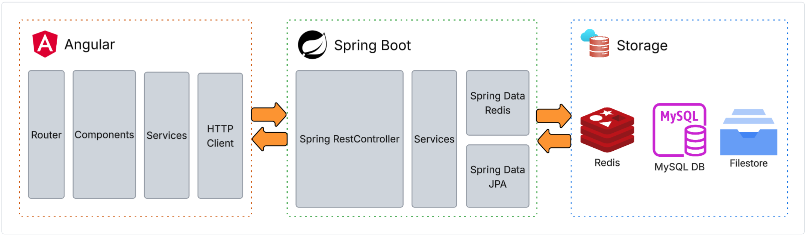

# Introduction

WISE is a full-stack application, comprised of

- Angular (client)
- Spring Boot (server)
- Redis, MySQL, Filestore (storage)

# Angular (client)

- **Router** routes users to pages that are comprised of **Components**.
- **Components** invoke **Services** for logic and data retrieval.
- **Services** utilize **HTTP Client** to send/retrieve data to/from the **Server**.

# Spring Boot (server)

- **RestControllers** provide endpoints to handle REST requests coming from the client. They invoke **Services** for logic and and data retrieval.
- **Services** utilize **Spring Data JPA** and **Spring Data Redis** to persist data in **Redis** and **MySQL**. They also persist user content to **Filestore**.

# Redis, MySQL, Filestore (storage)

- **Redis** stores key/value pairs needed for fast look-up like user sessions.
- **MySQL** stores relational data like user accounts, classroom runs, and student data.
- **Filestore** stores curriculum content and user assets.
