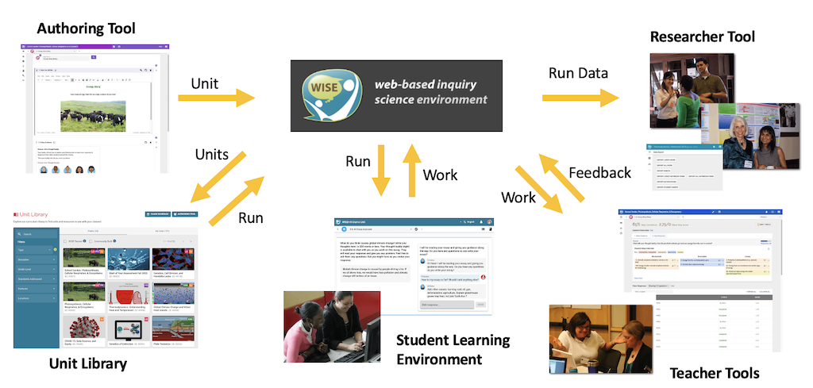

# Introduction

The WISE platform consists of several main applications that interact with each other to support the creation, delivery, and analysis of educational content. The diagram below illustrates the data flow between these applications.

_Figure: Main applications in WISE and the data flow between them._

# Main Applications

## 1. Authoring Tool

- **Description**: Teachers and Researchers use this tool to create a unit from scratch or edit exiting units.
- **Output**: Unit

## 2. Unit Library

- **Description**: A page that displays the units that are available for use in classrooms. These units are created by the Authoring Tool. The teacher can use the search and filter tools to find a unit to use in their classroom and they can go through some steps to set up a classroom run.
- **Input**: List of publically available units
- **Output**: A run, which is the selected unit that has been designated to be used for a specific cohort of students during a specific time.

## 3. Student Learning Environment

- **Description**: The student uses this tool to view and work on the run. They work on various activities (like Multiple Choice, Graph, Draw, Discussion) to learn the material and express their understanding.
- **Input**: Run that was set up by the teacher.
- **Output**: Student Work for the run

## 4. Teacher Tools

- **Description**: The teacher uses this tool to view student work and provide feedback (scores, comments) to the students. They can also use this tool to view student progress (unit completion, location of each student in the run).
- **Input**: Student work
- **Output**: Feedback (comments and scores)

## 5. Researcher Tool

- **Description**: Reseachers has access to all the data that was collected in the classroom and use this tool to download them. They can choose specific step or activities to export, as well as all revisions or just the latest saved data. They can export student notebooks, uploaded assets, notifications, etc.
- **Input**: All the work from the run, including student work and teacher feedback.
- **Output**: All the work in various formats that can be exported in CSV files that can then be opened in Excel for analysis. Researchers use this exported data to analyze and evaluate the effectiveness of the unit implementation.
