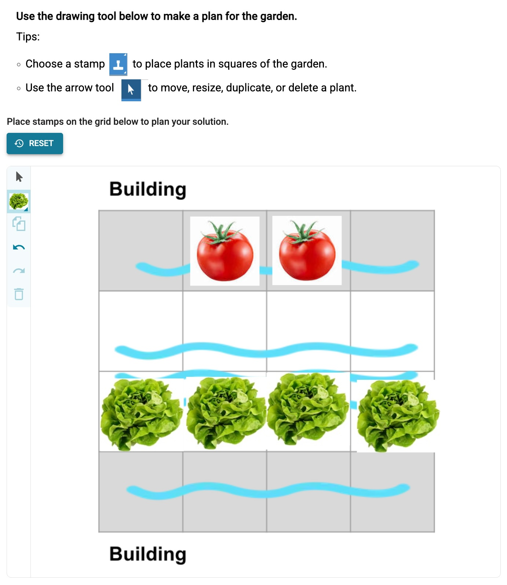
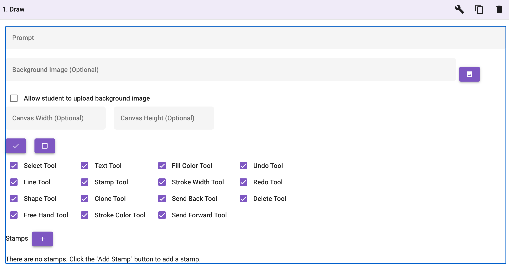

# Introduction

The Draw activity empowers students to express their ideas and demonstrate understanding visually. It provides a robust and customizable canvas where students can create diagrams, models, and illustrations directly within the WISE platform.

## Student Experience

_The student view of the Draw activity. In this example, students are asked to plan where to plant different types of plants in a school garden._

Depending on the author's configuration, students can engage with the Draw activity in various ways:

- **Creating Models:** Build complex representations using custom stamps (e.g., creating molecules from atom stamps).
- **Annotating:** Add text, shapes, and lines over providing background images to highlight key features or explain concepts.
- **Free Drawing:** Use free-hand tools and shapes to sketch out ideas from scratch.
- **Refining Work:** Iteratively improve their drawings using essential tools like Undo/Redo, element layering (Send Forward/Back), and cloning.

## Authoring Capabilities

_The authoring view of the Drawing activity, showing the available tool options and configurations._

When creating a Draw activity, authors have fine-grained control over the student experience. The activity can be customized to offer a focused set of tools or a fully-featured drawing environment:

1. **Customizable Tool Palette:** Authors can select precisely which drawing tools are made available to students. This ensures the interface is perfectly suited to the specific task. The selectable tools include:
   - **Basic Drawing:** Free Hand Tool, Line Tool, Shape Tool, Text Tool
   - **Editing Options:** Select Tool, Clone Tool, Delete Tool
   - **Styling:** Fill Color Tool, Stroke Color Tool, Stroke Width Tool
   - **Layering:** Send Forward Tool, Send Back Tool
   - **History:** Undo Tool, Redo Tool
   - **Stamps:** Stamp Tool

2. **Custom Stamps:** One of the most powerful features of the Draw activity is the ability for authors to define custom stamps. For example, in a chemistry unit, authors can provide "atom" stamps (like Carbon, Oxygen, Hydrogen) allowing students to easily construct and visualize molecules.

3. **Background Images:** Authors can set a specific background image for the canvas. This is ideal for providing worksheets, maps, or diagrams that students need to annotate or draw over.

4. **Student Image Uploads:** Authors can choose to "Allow student to upload background image", giving students the freedom to bring in their own references or diagrams to work from.

5. **Canvas Configuration:** The physical dimensions of the drawing area can be controlled using the optional Canvas Width and Canvas Height settings.
