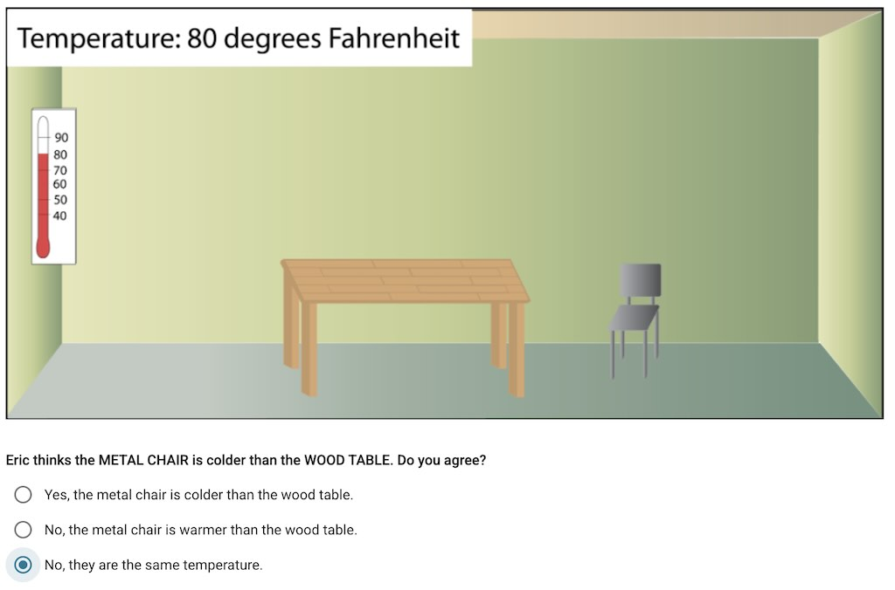
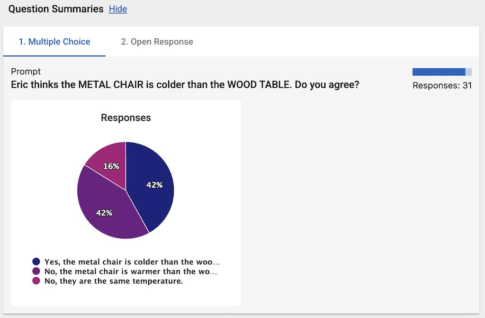

# Introduction

The Multiple Choice activity allows students to select one or more predefined answers from a list of options. It is a versatile tool for assessing student understanding, gathering opinions, or checking knowledge.

_The student view of the Multiple Choice activity. In this example, students are asked to choose if the metal chair is colder than the wood table._

## Capabilities

The Multiple Choice activity offers several key capabilities to enhance the learning experience:

1. **Rich Choices:** Text and images can be used as choices, providing flexibility in how options are presented.
2. **Immediate Feedback:** Each choice can have specific feedback that is displayed to the student when that choice is selected.
3. **Correctness Checking:** Activities can be configured to have "correctness"—students can immediately see if they chose the correct choice(s) after submitting their answer.
4. **Answer Modes:**
   - **Single Answer Mode:** Lets students choose only one answer at a time using a radio button.
   - **Multiple Answer Mode:** Lets students choose multiple answers simultaneously using checkboxes.

## Teacher View

- **Distribution Graph:** In the summary view, the teacher can see a graph showing the distribution of the students' choices. This makes it easy to gauge class-wide understanding and identify common trends at a glance.

_The teacher view of the Multiple Choice activity. In the summary view in the Teacher Tools, the teacher can see the distribution of the students' choices._
