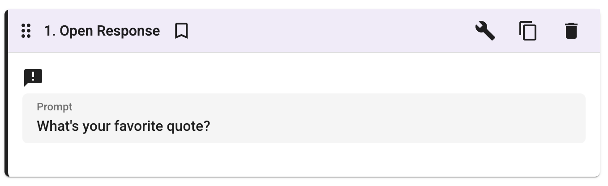
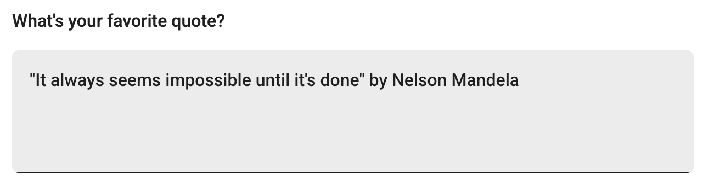

# Introduction

The Open Response activity gives students a free-form text area to write their answer to a prompt. It is ideal for capturing explanations, reflections, hypotheses, and other open-ended responses that require students to express ideas in their own words.

## Authoring

_The authoring view of the Open Response activity._

When creating an Open Response activity, authors can configure the following:

- **Prompt:** Set the question or instruction that students will respond to.
- **Starter Text (optional):** Provide initial text that pre-fills the student's response area. This can be used to scaffold the response with sentence starters or a template.
- **Audio Response (optional):** Allow students to record an audio response in addition to, or instead of, typing their answer.

## Student View

_The student view of the Open Response activity. Students type their answer in the text area below the prompt._

Students see the prompt and can write their answer directly in the text box. If the author has enabled audio responses, students will also have the option to record their answer using their microphone.
