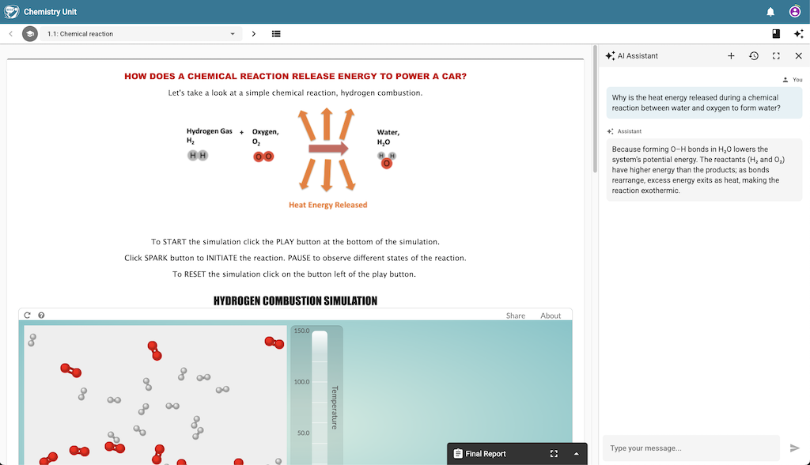

# Introduction

The WISE AI Assistant is a tool designed to help you navigate your curriculum, brainstorm ideas, and ask questions directly within the platform. The assistant is **persistent** and will be **context-aware** in the future.

_The AI Assistant is available in the sidebar and can be toggled on and off, and expanded to take up the entire screen._

## Key Features

### 1. Persistent Conversations

The assistant is globally available in the sidebar, so you can keep the conversation going as you work on the unit. You can start a new conversation or switch to an existing conversation.

Your chats are automatically saved to your account, so you don't need to worry about losing your progress or the assistant's previous explanations. When you send a message, it records the timestamp and the step that you were on.

### 2. Multiple Chat Sessions

You can maintain multiple separate conversations. This allows you to:

- Keep different topics organized.
- Start a "fresh" conversation for a new lesson or step.
- Preserve important information in one chat while experimenting in another.

### 3. Smart Title Generation

After your first few messages, the assistant automatically generates a concise, relevant title for your chat (e.g., "Photosynthesis Discussion" or "Bridge Design Help"). This makes it easy to find specific conversations in your history.

### 4. Flexible Interface

The chatbot can be used in two modes:

- **Sidebar Mode:** Keep the chat open on the side while you work on your curriculum.
- **Fullscreen Mode:** Expand the chat to focus entirely on your conversation with the AI.

It will also work on small screens like mobile devices.

### 5. Context Awareness (Planned for future release)

In the future, the assistant will know which part of the curriculum you are currently working on. When you ask a question, it automatically considers your current step to provide more relevant and helpful guidance.

---

## How to Use the Assistant

### Opening the Assistant

To open the assistant, click the **"Assistant"** icon in the menu bar. You can close the assistant by clicking on this icon again or by clicking the **"X"** icon in the top-right corner.

### Starting a New Chat

To start a fresh conversation, click the **"New Chat"** icon. The assistant will start with a system prompt tailored to the WISE unit that you are currently working on.

### Viewing Chat History

Click the **"History"** icon to open a list of all your previous conversations. You can switch between active chats or review past discussions at any time.

### Sending Messages

- Type your message in the input field at the bottom.
- Press **Enter** to send.
- Press **Shift + Enter** for a new line.

### Managing Layout

- Use the **Fullscreen** button to expand the chat window for better readability during long discussions.
