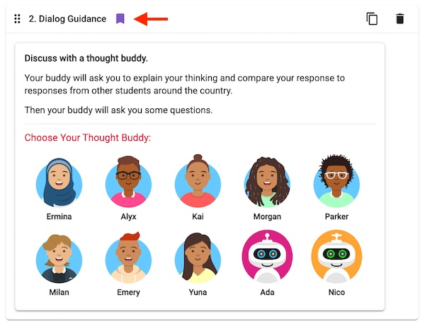
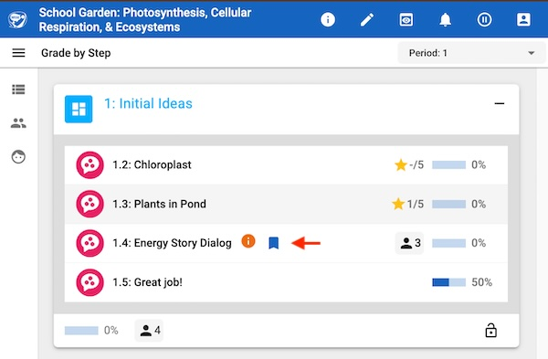
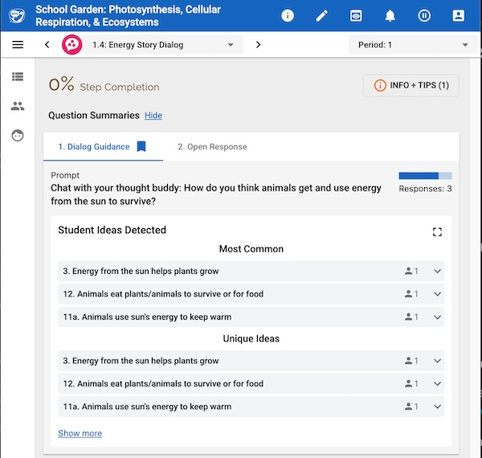

# Introduction

The Bookmark Activity feature allows teachers to quickly see important activities in the Teacher Tools. These activities appear with a bookmark icon in the teacher tools, such as in the step listing page and in the activities tabs in the step grading page.

## Authoring Tool

In the Authoring Tool, the author can bookmark or un-bookmark an activity by toggling the bookmark icon located next to the activity type in the step editing page.

_The bookmark on an activity can be toggled in the Authoring Tool._

## Teacher Tools

The Bookmark Activity feature enhances the teacher's navigation and review workflows by highlighting and providing quick access to bookmarked activities.

**Step Listing Page:** If a step contains a bookmarked activity, a bookmark icon will appear next to the step title. Clicking on this icon will take you directly to the step grading page, and will automatically open to the first bookmarked activity within that step.

_The bookmark icon in the step listing page._

**Step Grading Page:** If an activity in the step is bookmarked, it will display the bookmark icon on its respective tab. You will also see the bookmark icon next to the bookmarked activity in the "Class Responses" filter listing, allowing you to easily identify and focus on key activities.

_The bookmark icon in the step grading page._
