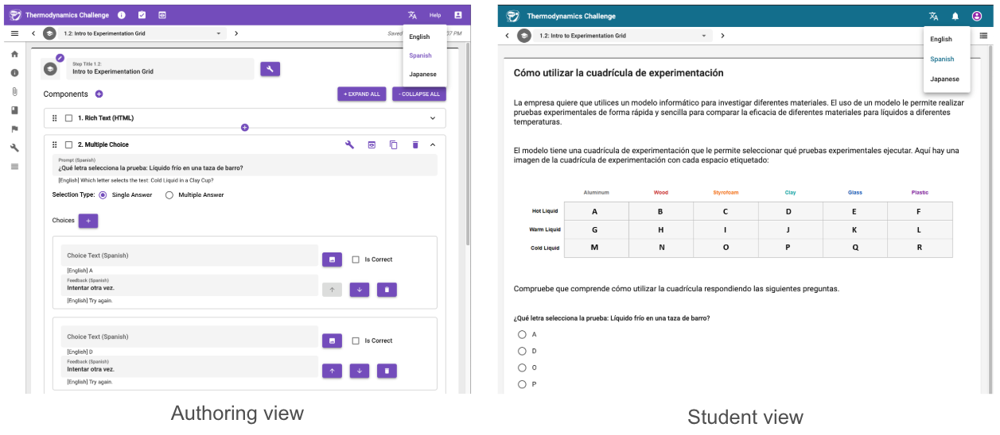
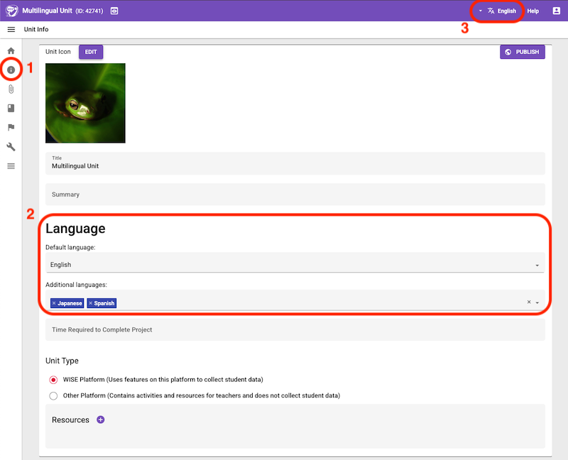
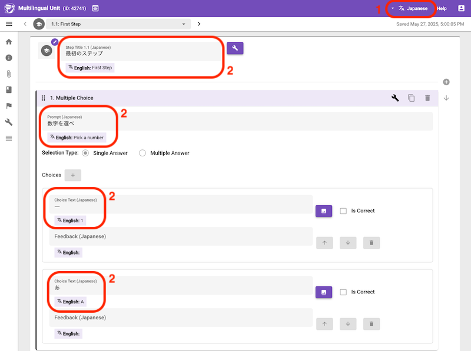
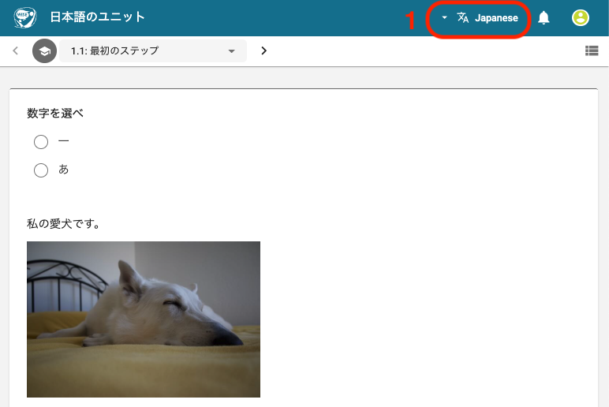

- [Introduction](#introduction)
- [Authoring](#authoring)
  - [Enable multilingual feature for a unit](#enable-multilingual-feature-for-a-unit)
  - [Translate the unit in different languages](#translate-the-unit-in-different-languages)
- [Student view](#student-view)
- [Logging language choices (for researchers)](#logging-language-choices-for-researchers)

## Introduction

WISE units can be delivered in multiple languages. Students can choose to view the unit in a language of their choosing.

_Use the authoring tool (left) to translate a unit in multiple languages. Students (right) can toggle between the languages._

## Authoring

### Enable multilingual feature for a unit

To use this feature, open the authoring tool and add languages in the unit info page.

_1. Go to Unit Info page in the authoring tool. 2. Add additional languages. 3. Languages chooser appears._

### Translate the unit in different languages

Use the authoring tool to switch between the different languages and translate the unit.

_1. Choose a language. 2. Translate unit in the selected language. You can see the text in the default language below the input field._

## Student view

Preview the unit. You should see a language selector. When you choose a language, the unit should appear in that language. Note: parts of the unit that have not been translated yet will appear in the default language.

_1. Choose a language. You can see the unit in the chosen language._

## Logging language choices (for researchers)

Every time the student changes the language, we store the timestamp and the new language selection. From this and other navigation events that WISE currently logs (step entered, step existed, etc), you should be able to reconstruct how many times the students changed the language, how long they used each language, and in which language the student viewed the steps.
