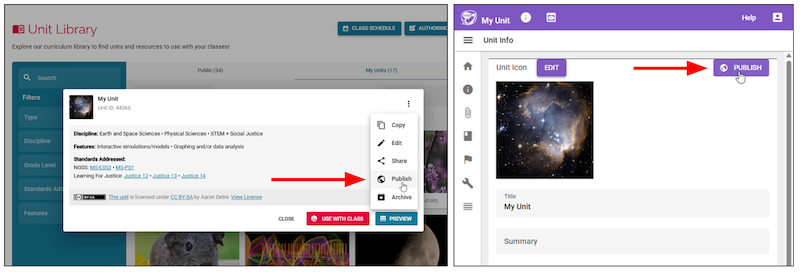
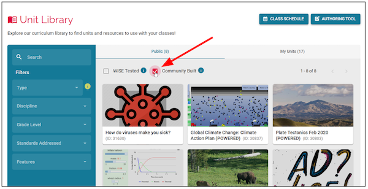

## Introduction

Unit authors can easily share their STEM units with the WISE community by publishing their units. If you would like to share your unit, it will be reviewed by our team before being added to the WISE Community Built library!

## Submitting your unit for review

Once you have finished authoring your unit and have decided you would like to make it publicly available, there are two ways to access the sharing form. Either go to the Unit Library, find your unit in the My Units tab, and select “Publish” from the dropdown menu. Or open your unit’s “Unit Info” page in the Authoring Tool and click the “Publish” button.

These buttons will take you to the contact form where you should add a brief description of why you would like to share your unit with the community.

## Review process

When you submit the form, your unit will be sent to us for review. We will make sure that you have filled out all appropriate fields in the Unit Info page and that the unit doesn’t contain any content that would be inappropriate to show students in a classroom setting. Assuming it all looks good, we will add the unit to the Community Built library!

If you have a unit that you are proud of, you can publish it so that other teachers around the world can use your unit in their classrooms.
