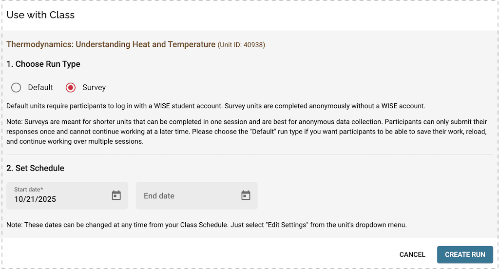

Survey feature was introduced on June 6, 2025. It allows teachers to set up unit for use without asking participants to create student accounts. Surveys are meant for shorter units that can be completed in one session and are best for anonymous data collection. Participants can only submit their responses once and cannot continue working at a later time.

_Use with class dialog with the Survey option selected._

When a survey unit is created, WISE will generate a unique URL that can be sent to the users. The users can access the unit anonymously by visiting the URL in a browser.
